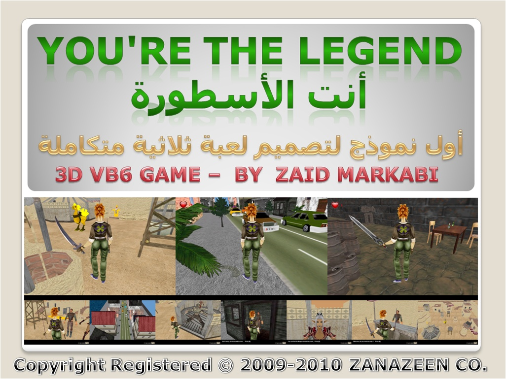



## LEGEND \- 3D VB GAME

### Description

Industrial Quality 3D

This demo was developed using Visual Basic 6 , DirectX8 and TrueVision3D .

You must have a 3D Graphic Accelerator Card and Sound card to play it.

LEGEND features include mesh animation, sizable viewport, true 3D sound, complex physics, fighter ai and more.

System requirements: Windows 95/98/00/ME/XP/Vista, Microsoft DirectX8, Soundcard.

COPYRIGHT REGISTERED (c) 2009-2010 ZANAZEEN CO.

Copyright registered for the code, not for the resources of the game.

Keys :

[ Up ] : Walk forward

[Left ] : Rotate to left

[Right] : Rotate to right

[Down ] : Walk backward

[Space] : Use the Sword

[LCtrl] : Special Attack

[ E ] : Pick up item , Skip stories

[ Esc ] : Exit to windows

COPYRIGHT REGISTERED (c) 2009-2010 ZANAZEEN CO.

You can use any Model or Sound file in your projects for free,

Copyright registered for the code, not for the resources of the game.

Check last games :

http://yazanmarkabi.webs.com/apps/forums/topics/show/1313961-you-are-the-legend-3d-vb-game?page=last
 
### More Info
 

             |
---                |---
**Submitted On**   |2009-09-09 19:37:50
**By**             |[Zaid Markabi](https://github.com/Planet-Source-Code/PSCIndex/blob/master/ByAuthor/zaid-markabi.md)
**Level**          |Advanced
**User Rating**    |5.0 (15 globes from 3 users)
**Compatibility**  |VB 5\.0, VB 6\.0
**Category**       |[DirectX](https://github.com/Planet-Source-Code/PSCIndex/blob/master/ByCategory/directx__1-44.md)
**World**          |[Visual Basic](https://github.com/Planet-Source-Code/PSCIndex/blob/master/ByWorld/visual-basic.md)
**Archive File**   |[LEGEND\_\-\_32162369112009\.zip](https://github.com/Planet-Source-Code/zaid-markabi-legend-3d-vb-game__1-72447/archive/master.zip)

